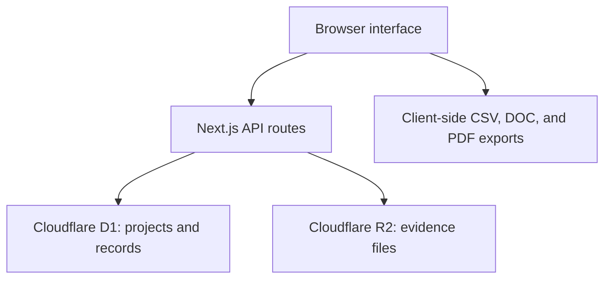

# UIR Motorsports Documentation Hub

> A centralized engineering documentation platform for UIR Motorsports and the development of **HOPE**, the team's Formula Student car.

**Dream it. Design it. Drive it.**

[Open the current Documentation Hub](https://uir-motorsports-docs.modiaa2208004.chatgpt.site)

## Project overview

The UIR Motorsports Documentation Hub is an internal web platform for capturing the engineering work behind a Formula Student car. It replaces disconnected files and informal updates with guided records that connect decisions, calculations, tests, risks, manufacturing evidence, and progress reports to one vehicle programme.

The platform is being developed for UIR Motorsports' 2026–2027 season and its first running Formula Student car, **HOPE**, targeting Formula Student UK 2027 in the Internal Combustion class.

The current repository contains the working MVP. It is suitable for controlled testing, but it is not yet the final multi-user production system.

## Why this platform exists

Formula Student documentation must explain more than the final design. A strong engineering record should show:

- The requirement, rule, or problem that started the work.
- The alternatives considered and the criteria used to compare them.
- The calculations, simulations, drawings, tests, and references supporting the decision.
- The compromises and risks accepted by the team.
- The planned or completed verification.
- Who owns, reviews, and approves the work.

The Documentation Hub is designed to capture this information while the car is being developed, then reuse approved records when preparing competition documents and design-review evidence.

## Current capabilities

- Configure the active vehicle project, season, competition, class, objective, and summary.
- Create structured engineering records through guided templates.
- Organize records by subsystem, owner, reviewer, and status.
- Search records and monitor completion from the dashboard.
- Upload supporting evidence with captions and attach it to a specific record.
- Store structured data in Cloudflare D1 and evidence files in Cloudflare R2.
- Track the basic workflow states `Draft`, `In review`, `Returned`, and `Approved`.
- Export the record register as CSV.
- Generate an engineering evidence pack as a browser-created Word-compatible `.doc` file or PDF.

### Guided record templates

| Template | Purpose |
|---|---|
| Design Decision | Requirements, alternatives, criteria, trade-offs, analysis, selection, and validation |
| Calculation / Simulation | Model objective, method, inputs, assumptions, results, sensitivity, validation, and conclusion |
| Physical Test | Test objective, setup, method, conditions, results, uncertainty, and action |
| Risk / FMEA | Failure modes, effects, causes, ratings, controls, ownership, and verification |
| Manufacturing Record | Material, process, tooling, quality controls, time, cost, carbon evidence, and acceptance |
| Weekly Progress | Completed work, evidence, blockers, decisions, next actions, and requested support |

## Current development status

This project is an **alpha/MVP**. The core documentation workflow works, but the controls required for full-team use are still under development.

| Area | Current state |
|---|---|
| Project dashboard and guided records | Available |
| D1 database persistence | Available |
| R2 evidence uploads and downloads | Available; maximum 10 MB per file |
| Search, completeness, and basic statuses | Available |
| CSV, Word-compatible, and PDF exports | Available in basic form |
| Multi-user invitations and team directory | Planned |
| Server-enforced role permissions | Planned |
| Review comments and approval authority | Planned |
| Locked approvals, immutable revisions, and audit history | Planned |
| Microsoft OneDrive integration | Entra application prepared; website integration not implemented |
| Native `.docx` generation and professional report layouts | Planned |
| Automated FSUK rules and submission checks | Planned |

Do not treat the current `Approved` status as a formal locked approval. In this version, it is a selectable record state and can still be changed.

## System architecture



The planned OneDrive integration will introduce a storage adapter so evidence and generated reports can be routed to Microsoft OneDrive while D1 continues to hold the structured workflow data.

## Technology stack

| Layer | Technology |
|---|---|
| Application | Next.js 16, React 19, TypeScript |
| Build/runtime | Vinext, Vite, Cloudflare Workers |
| Database | Cloudflare D1 with Drizzle ORM |
| File storage | Cloudflare R2 |
| PDF export | jsPDF |
| Styling | Project CSS with Geist and Geist Mono |
| Hosting | OpenAI Sites |

## Getting started

### Prerequisites

- Node.js `22.13.0` or newer
- npm
- Linux or WSL for the repository's verified helper scripts

### Installation

```bash
git clone <your-private-repository-url>
cd uir-motorsports-documentation-hub
npm run install:ci
```

### Start the development server

```bash
npm run dev
```

The application declares its logical D1 and R2 bindings in `.openai/hosting.json`. The Sites development and hosting environment supplies the corresponding resources. The database schema and migrations are stored in `db/` and `drizzle/`.

### Available commands

| Command | Purpose |
|---|---|
| `npm run dev` | Start the local development server |
| `npm run build` | Create and validate the production artifact |
| `npm start` | Start the built application |
| `npm test` | Build, validate, and run the rendered-HTML test |
| `npm run lint` | Run ESLint |
| `npm run db:generate` | Generate a Drizzle migration after a schema change |
| `npm run validate:artifact` | Validate an existing deployment artifact |

## Repository structure

```text
.
├── app/
│   ├── api/                 # Project, record, and evidence API routes
│   ├── chatgpt-auth.ts      # Optional ChatGPT identity helpers
│   ├── globals.css          # Application styling
│   ├── hub.tsx              # Main Documentation Hub interface
│   ├── layout.tsx           # Root layout and metadata
│   └── page.tsx             # Main route
├── db/
│   ├── index.ts             # D1 connection
│   └── schema.ts            # Drizzle database schema
├── drizzle/                 # SQL migrations and migration metadata
├── public/                  # Static assets and favicon
├── scripts/                 # Installation, build, and artifact validation helpers
├── tests/                   # Automated tests
├── worker/                  # Cloudflare Worker entry point
├── .openai/hosting.json     # Sites project and logical storage bindings
├── package.json
└── vite.config.ts
```

## Data model

The current database uses three main tables:

| Table | Stores |
|---|---|
| `projects` | Vehicle programme identity, season, competition, class, objectives, summary, and status |
| `engineering_records` | Record type, subsystem, owner, reviewer, workflow status, guided answers, and completeness |
| `record_evidence` | Evidence metadata, captions, file type, size, and R2 object key |

## API routes

| Method and route | Function |
|---|---|
| `GET /api/projects` | List projects and initialize the default project when necessary |
| `POST /api/projects` | Create a project |
| `PATCH /api/projects/:id` | Update project information |
| `GET /api/records` | List recent engineering records |
| `POST /api/records` | Create an engineering record |
| `GET /api/records/:id` | Read a record |
| `PATCH /api/records/:id` | Update a record and recalculate completeness |
| `GET /api/evidence?recordId=...` | List evidence attached to a record |
| `POST /api/evidence` | Upload evidence to R2 and save its metadata |
| `GET /api/evidence/:id` | Download a stored evidence file |

## Intended engineering workflow

1. Define the active vehicle programme and measurable season objectives.
2. Select the correct guided record template.
3. Describe the engineering problem or purpose.
4. Complete the guided questions with numbers, assumptions, units, and references.
5. Attach drawings, images, calculations, spreadsheets, simulations, or test results.
6. Submit the record for technical review.
7. Resolve review comments and create a new revision when required.
8. Approve and lock the verified version.
9. Reuse approved records when generating competition reports and evidence packs.

Steps 1–5 and the basic status flow exist in the MVP. Controlled reviews, immutable revisions, and approval locking are part of the roadmap.

## Roadmap

1. Add approved team accounts, departments, and role-based permissions.
2. Add review comments, revision requests, approval authority, locking, and audit events.
3. Connect Microsoft OneDrive through Microsoft Graph with secure server-side token storage.
4. Create automatic OneDrive folder routing for projects, departments, records, and reports.
5. Generate native Word `.docx` files and professionally formatted PDFs.
6. Add FSUK-specific completeness, drawing, page-limit, and submission checks.
7. Pilot the complete workflow with five team members before team-wide release.

## Security and data handling

- Keep the GitHub repository private while the platform contains team-specific implementation details.
- Never commit `.env` files, Microsoft client secrets, access tokens, database credentials, or private engineering evidence.
- Do not place secrets in frontend code or in `.openai/hosting.json`.
- Enforce authorization on the server before opening the platform to the full team.
- Back up approved records and generated submissions outside the application.
- Treat uploaded engineering files and competition documents as controlled team material.

## Contributing

1. Create a short feature or fix branch.
2. Keep each change focused on one issue.
3. Update the database schema and generate a migration when the stored data changes.
4. Run `npm run lint` and `npm test` before requesting review.
5. Explain the user workflow affected by the change in the pull request.
6. Do not merge authentication, approval, or storage changes without a second review.

## Project ownership

Developed for **UIR Motorsports** at the International University of Rabat.

This repository currently has no open-source license and is intended for authorized UIR Motorsports use.

---

**UIR Motorsports — Dream it. Design it. Drive it.**
